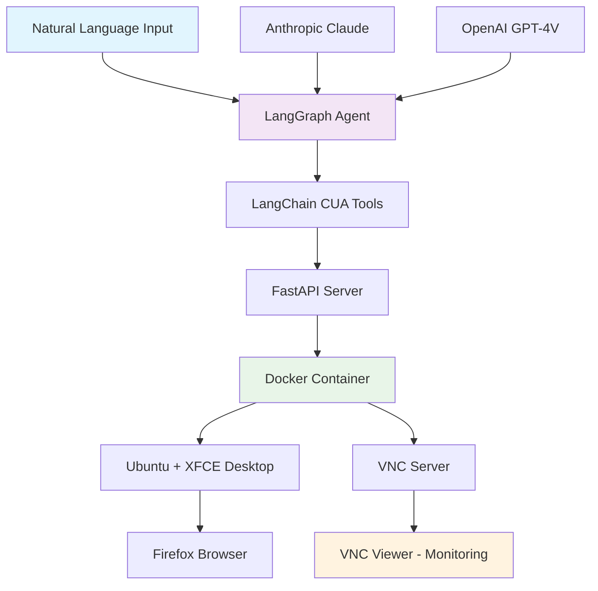

# LangGraph Computer Use Open Source 🤖💻

[](https://opensource.org/licenses/MIT)
[](https://www.docker.com/)
[](https://langchain.com/)
[](https://www.python.org/)

**Control any computer using natural language through AI vision and multimodal LLMs**

A production-ready, fully open-source system that combines Docker containerization, VNC remote access, and LangChain/LangGraph integration to create autonomous computer-controlling agents with vision capabilities.

> **🆚 Why Choose This Over LangChain's Official CUA?**
> 
> Unlike LangChain's cloud-dependent solution, this is **100% self-hosted, free, and transparent**:
> - ✅ **No API dependencies** - runs completely offline
> - ✅ **Zero cost** - no Scrapybara subscription fees
> - ✅ **Full control** - inspect, modify, and extend everything
> - ✅ **Real VNC monitoring** - watch your agent work in real-time
> - ✅ **True open source** - Apache/MIT license, no vendor lock-in

## 🎯 What is CUA?

Computer Use Agent (CUA) is an AI system that can:

- **See** - Take screenshots and understand visual content using multimodal LLMs
- **Think** - Process natural language instructions and plan actions
- **Act** - Control mouse, keyboard, and applications with pixel-perfect precision
- **Interact** - Work with any GUI application through visual feedback

Perfect for browser automation, application testing, data entry, and any task requiring computer interaction.

## ✨ Key Features

### 🖥️ **Complete Computer Control**
- Mouse clicks, movement, and scrolling
- Keyboard input and key combinations
- Screenshot capture and analysis
- Window and application management

### 🔍 **Vision-Powered Intelligence** 
- Anthropic Claude vision integration
- OpenAI GPT-4V support
- Screen understanding and UI element detection
- Natural language descriptions of visual content

### 🚀 **Production Ready**
- Dockerized environment with Ubuntu + XFCE
- VNC server for real-time monitoring
- FastAPI server with REST endpoints
- Error handling and retry logic

### 🔧 **LangChain Integration**
- Full LangChain tools compatibility
- LangGraph agent workflows
- Memory and state management
- Streaming responses and checkpoints

### 🛡️ **Isolation & Safety**
- Sandboxed Docker environment
- VNC monitoring of all actions
- Controlled network access
- Easy start/stop/reset

## 🚀 Quick Start

### Prerequisites
- Docker installed
- Python 3.8+
- VNC viewer (optional, for monitoring)

### 1. Clone and Setup

```bash
git clone https://github.com/yourusername/computer-use-agent.git
cd computer-use-agent

# Copy environment template
cp env_example .env
# Edit .env with your API keys
```

### 2. Build and Run Docker Container

```bash
# Build the CUA environment
docker build -f Dockerfile.clean -t cua-agent .

# Run with VNC and API access
docker run -d --name cua-container \
  -p 5900:5900 \
  -p 8001:8001 \
  cua-agent
```

### 3. Install Python Dependencies

```bash
pip install -r requirements_langchain.txt
```

### 4. Set API Keys

Edit `.env` file:
```bash
ANTHROPIC_API_KEY=your-anthropic-key-here
OPENAI_API_KEY=your-openai-key-here  # Optional
```

### 5. Run the Agent

```bash
python langgraph_cua_agent.py
```

Choose option 2 for interactive mode and try:
```
"Navigate to google.com and search for 'AI automation'"
```

## 🎮 Usage Examples

### Basic Computer Control
```python
from langchain_cua_tools import *

# Take a screenshot
screenshot = await take_screenshot.ainvoke({})

# Click at coordinates
await click_at_coordinates.ainvoke({"x": 100, "y": 200})

# Type text
await type_text.ainvoke({"text": "Hello, AI!"})

# Press key combinations
await press_keys.ainvoke({"keys": ["ctrl", "c"]})
```

### Natural Language Tasks
```python
from langgraph_cua_agent import run_cua_agent_task

# Web browsing
await run_cua_agent_task("Go to GitHub and search for 'langchain'")

# Application automation
await run_cua_agent_task("Open calculator and compute 123 * 456")

# Data entry
await run_cua_agent_task("Fill out the form with test data")

# Visual analysis
await run_cua_agent_task("Describe everything you see on the screen")
```

### Advanced Workflows
```python
# Multi-step automation
task = """
1. Navigate to news.ycombinator.com
2. Find the top story
3. Take a screenshot
4. Summarize the headline and comments
"""
await run_cua_agent_task(task)
```

## 🏗️ Architecture



## 📁 Project Structure

```
computer-use-agent/
├── 🐳 Docker Setup
│   ├── Dockerfile.clean          # Clean Ubuntu + XFCE environment
│   ├── start.sh                  # Container startup script
│   ├── cua_server.py            # FastAPI server for computer control
│   └── .dockerignore            # Docker build optimization
│
├── 🤖 LangChain Integration  
│   ├── langgraph_cua_agent.py   # Main agent with LangGraph
│   ├── langchain_cua_tools.py   # CUA tools for LangChain
│   ├── final_anthropic_cua_tool.py # Anthropic vision integration
│   └── requirements_langchain.txt  # Python dependencies
│
├── 📚 Documentation
│   ├── README.md                # This file
│   ├── PRODUCTION_README.md     # Production deployment guide
│   ├── README_LANGCHAIN.md      # LangChain integration details
│   └── env_example             # Environment variables template
│
└── 🔧 Configuration
    └── .env                     # API keys (create from env_example)
```

## 🛠️ Available Tools

| Tool | Description | Use Case |
|------|-------------|----------|
| `take_screenshot` | Capture current screen | Visual analysis, debugging |
| `click_at_coordinates` | Click at specific location | Button clicks, link navigation |
| `type_text` | Type text at cursor | Form filling, text input |
| `press_keys` | Send key combinations | Shortcuts, navigation |
| `navigate_to_url` | Navigate browser to URL | Web automation |
| `move_cursor` | Move mouse cursor | Hover effects, positioning |
| `scroll_at_location` | Scroll at specific area | Page navigation |
| `double_click_at_coordinates` | Double-click action | File opening, selection |
| `get_screen_dimensions` | Get screen resolution | Layout calculations |
| `take_screenshot_and_analyze` | Screenshot + AI analysis | Vision-powered understanding |

## 🔍 Monitoring & Debugging

### VNC Access
Connect to `localhost:5900` with any VNC viewer to watch the agent in real-time:

```bash
# Using built-in VNC viewer (macOS)
open vnc://localhost:5900

# Using VNC viewer applications
vncviewer localhost:5900
```

### API Endpoints
The FastAPI server exposes these endpoints:
- `GET /screenshot` - Capture screen
- `POST /click` - Click at coordinates  
- `POST /type` - Type text
- `POST /keypress` - Press keys
- `GET /dimensions` - Get screen size

### Logs and Debugging
```bash
# View container logs
docker logs cua-container

# Execute commands inside container
docker exec -it cua-container bash

# Check API server status
curl http://localhost:8001/dimensions
```

## 🥊 LangChain Official vs. This Open Source Implementation

| Feature | LangChain Official CUA | **This Open Source CUA** |
|---------|----------------------|---------------------------|
| **Cost** | 💰 Requires Scrapybara API (~$0.10-$1.00/hour) | ✅ **100% Free** |
| **Infrastructure** | ☁️ Cloud-dependent (Scrapybara) | 🏠 **Self-hosted Docker** |
| **Privacy** | ⚠️ Data sent to third-party service | 🔒 **Complete data privacy** |
| **Monitoring** | 📹 Stream URL (limited) | 👁️ **Full VNC access** |
| **Customization** | 🔒 Limited to API parameters | 🛠️ **Full source code control** |
| **Offline Capability** | ❌ Requires internet | ✅ **Works completely offline** |
| **Setup Complexity** | 🔑 API keys + billing setup | 🐳 **Just Docker run** |
| **Vendor Lock-in** | 🔗 Tied to Scrapybara service | 🆓 **Vendor independent** |
| **Environment Control** | 🏢 Predefined Ubuntu/Windows VMs | 🎨 **Custom Docker environments** |
| **Data Retention** | ⚠️ Subject to vendor policies | 🗑️ **You control all data** |
| **Debugging** | 📊 Limited API logs | 🔍 **Full container access** |
| **Extensions** | 📦 Limited to LangChain ecosystem | 🔧 **Extend anything** |

### 🎯 **Why This Matters**

#### **💰 Cost Savings**
```bash
# LangChain Official: $0.10-$1.00 per hour
# 8 hours/day × 30 days = $24-$240/month per agent

# This implementation: $0
# Run unlimited agents forever
```

#### **🔒 Complete Privacy**
```python
# LangChain Official: Screenshots sent to Scrapybara
screenshot_data → Scrapybara API → Their servers

# This implementation: Everything local
screenshot_data → Local Docker → Your control
```

#### **🛠️ Full Customization**
```python
# LangChain Official: Limited parameters
cua_graph = create_cua(
    timeout_hours=2,  # Only basic config
    environment="ubuntu"
)

# This implementation: Modify everything
class CustomCUAServer(FastAPI):
    def custom_screenshot_processing(self):
        # Your custom logic here
        pass
```

#### **👁️ Real-Time Monitoring**
```bash
# LangChain Official: Stream URL (view only)
# Limited visibility into what's happening

# This implementation: Full VNC access
vncviewer localhost:5900
# Watch, interact, debug in real-time
```

## 🎨 Advanced Features

### Custom LLM Providers

```python
# Use Anthropic Claude
from langchain_anthropic import ChatAnthropic
llm = ChatAnthropic(model="claude-3-sonnet-20240229")

# Use local models via Ollama
from langchain_ollama import ChatOllama
llm = ChatOllama(model="llama3")
```

### Memory and Persistence

```python
from langgraph.checkpoint.sqlite import SqliteSaver
memory = SqliteSaver.from_conn_string("checkpoints.sqlite")
agent = create_react_agent(llm, tools, checkpointer=memory)
```

### Tool Composition

```python
# Combine with other LangChain tools
from langchain_community.tools import DuckDuckGoSearchRun, WikipediaQueryRun

tools = get_all_cua_tools() + [
    DuckDuckGoSearchRun(),
    WikipediaQueryRun()
]
```

## 🛡️ Safety & Security

### Isolation
- **Docker sandbox** prevents system access
- **Network isolation** controls internet access
- **VNC monitoring** shows all agent actions
- **Resource limits** prevent system overload

### Best Practices
- Always monitor via VNC during development
- Use rate limiting for production deployments
- Implement approval workflows for sensitive actions
- Regular container restarts for clean state

### Error Handling
- Automatic retries on network failures
- Vision-based error detection and recovery
- Graceful degradation when tools fail
- Comprehensive logging for debugging

## 🚀 Production Deployment

### Scaling
```bash
# Run multiple containers
docker run -d --name cua-1 -p 5901:5900 -p 8002:8001 cua-agent
docker run -d --name cua-2 -p 5902:5900 -p 8003:8001 cua-agent
```

### Resource Management
```bash
# Set resource limits
docker run -d --name cua-container \
  --memory="2g" \
  --cpus="1.0" \
  -p 5900:5900 -p 8001:8001 \
  cua-agent
```

### Health Monitoring
```python
# Health check endpoint
@app.get("/health")
async def health_check():
    return {"status": "healthy", "timestamp": time.time()}
```

## 🤝 Contributing

We welcome contributions! Here's how to get started:

1. **Fork the repository**
2. **Create a feature branch**: `git checkout -b feature/amazing-feature`
3. **Make your changes**:
   - Add new tools in `langchain_cua_tools.py`
   - Enhance agent behavior in `langgraph_cua_agent.py`
   - Improve Docker setup in `Dockerfile.clean`
   - Update documentation
4. **Test thoroughly** with VNC monitoring
5. **Submit a pull request**

### Development Setup
```bash
# Clone your fork
git clone https://github.com/yourusername/computer-use-agent.git
cd computer-use-agent

# Install development dependencies
pip install -r requirements_langchain.txt
pip install pytest black flake8

# Run tests
pytest

# Format code
black .
```

## 🐛 Troubleshooting

### Common Issues

**Container won't start**
```bash
# Check Docker logs
docker logs cua-container

# Common fix: remove old containers
docker rm -f cua-container
```

**VNC connection fails**
```bash
# Verify port is exposed
docker port cua-container 5900

# Check if VNC is running inside container
docker exec cua-container ps aux | grep vnc
```

**API not responding**
```bash
# Test API directly
curl http://localhost:8001/dimensions

# Check FastAPI server logs
docker exec cua-container cat /app/server.log
```

**Agent actions not working**
- Verify container is running: `docker ps`
- Check VNC to see actual screen state
- Ensure API keys are set correctly
- Monitor logs for error messages

## 📄 License

This project is licensed under the MIT License - see the [LICENSE](LICENSE) file for details.

## 🙏 Acknowledgments

- **Anthropic** for Claude vision capabilities
- **OpenAI** for GPT-4 vision API
- **LangChain** for the agent framework
- **Docker** for containerization
- **XFCE** for the lightweight desktop environment

## 📬 Support

- **Issues**: [GitHub Issues](https://github.com/yourusername/computer-use-agent/issues)
- **Discussions**: [GitHub Discussions](https://github.com/yourusername/computer-use-agent/discussions)
- **Documentation**: Check the `docs/` folder for detailed guides

---

**⭐ Star this repo if you find it useful!**

**🚀 Ready to automate your computer with AI? Get started now!**
